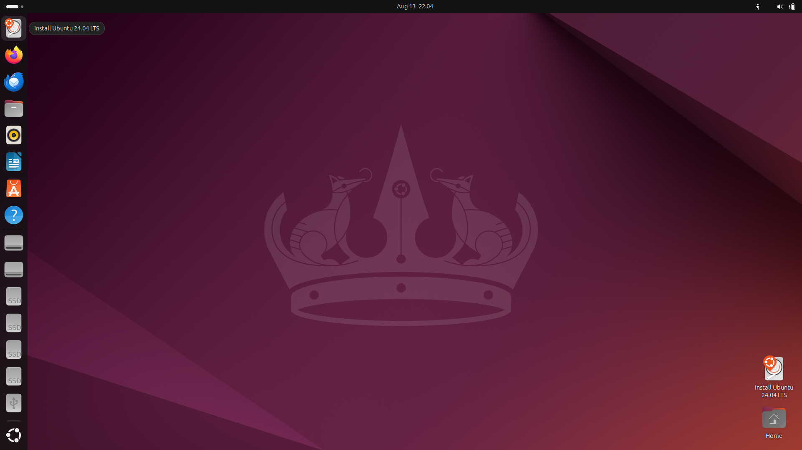
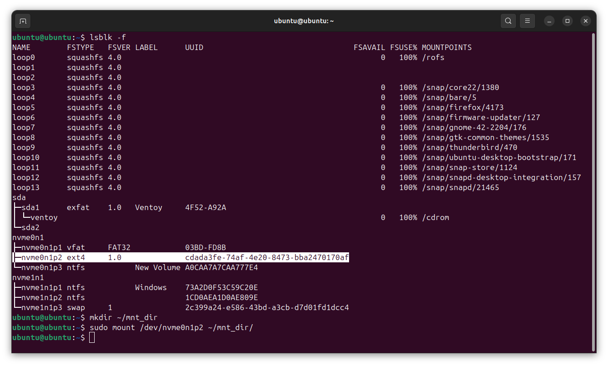
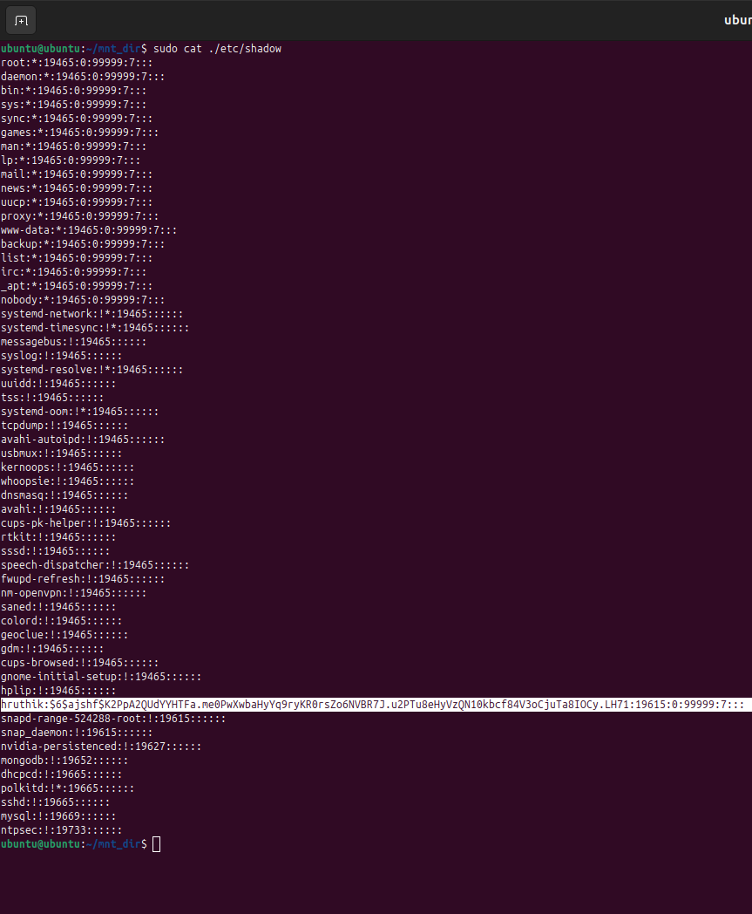
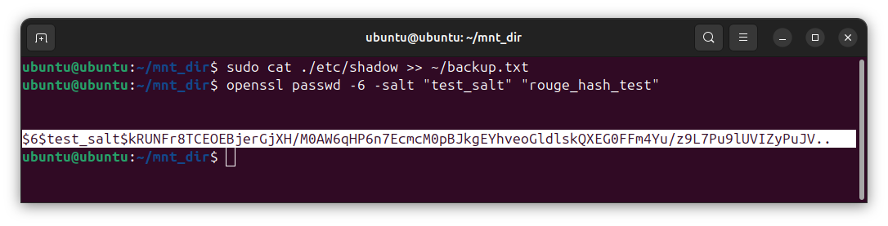
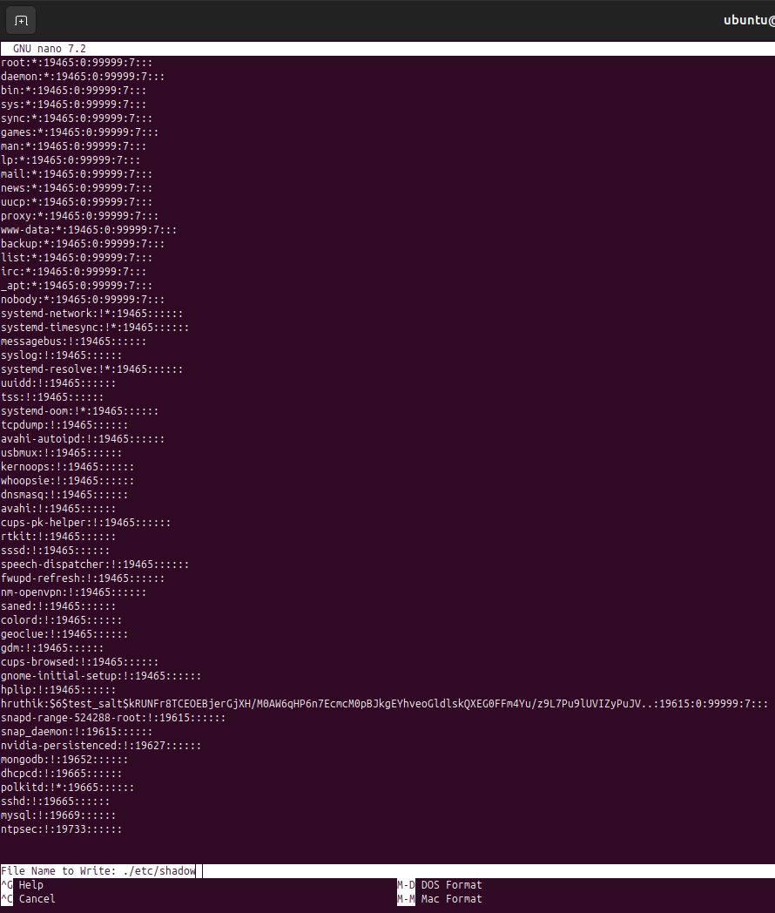

# RogueHash
## Objective :  
This document provides a detailed explanation, including screenshots, of how an individual with physical access to your device can change the password on a Linux-based operating system without requiring superuser privileges. (And then change back the password to the original password)

## Brief explanation :

Linux does not store user passwords in plain text. Instead, it stores a hash digest of the user’s password in a file called “shadow” file.
So every time the user tries to login it hashes the password entered by the user and compares this hash with the one stored in the “shadow” file.

If we want to change the password, then we basically have to change the hash digest in this file, to the new hash digest obtained by hashing the new password.
Let us say you got extremely lucky and you found the victim’s machine in unlocked state, but in order to modify or read the shadow file, you need to be have superuser privileges, for which you need the password, which brings us back to where we started.

So the kernel / OS which is currently running on the machine is blocking us from editing the shadow file, that is located on the hard disk.
So what do we do ?

We modify the shadow file when the kernel / OS is inactive, i.e when it is not running.

In detail :

1) We shut down the machine.
2) We run another OS (lets call it attack OS) on this machine using Live USB. (Choose it from boot menu)
3) Mount the partition where the shadow file of the victim’s OS is located and then edit the hash digest.

Since the victim’s shadow file is located in some other partition, the attack OS treats it like any other file and allows you to edit it.

## Implementation :

First, we need to flash an iso (bootable image) file on a USB.
I prefer flashing Ubuntu, reasons :

1) Can handle ext4, ext3 partitions (most linux root partitions are ext4)

2) Has “Try Ubuntu” feature, which lets you use Ubuntu without installing it on the victim’s machine (live USB), saves time and the hassle of installation.

This documentation skips the part of flashing the iso (I would recommend using ventoy) , selecting Ubuntu on the usb on boot menu and then selecting “Try ubuntu” in the grub menu.


(You can see the “Install Ubuntu 24.04 LTS” icon on the desktop, its a live usb)

This documentation skips the part of flashing the iso (I would recommend using ventoy) , selecting Ubuntu on the usb on boot menu and then selecting “Try ubuntu” in the grub menu.

### Listing partitions
Lets list all the partitions and mount the partition where victim’s shadow file is located



Most linux based OS use ext4 for root partition by default. You can figure out which partition is the victim’s root partition by mounting all the ext4 partitions one after another until you find the shadow file in one of the partitions.

### Reading the shadow file


You can see the victims password hash mentioned after the victims user name, in the following format :

hruthik:$6$ajshf$K2PpA2QUdYYHTFa.me0PwXwbaHyYq9ryKR0rsZo6NVBR7J.u2PTu8eHyVzQN10kbcf84V3oCjuTa8IOCy.LH71:19615:0:99999:7:::

which is in this format:

username:$id$salt$hash:other_data

other_data is does not play major role in this process, so it is not explained in depth.
other_data consists of data regarding expiry of password, last change date etc. You can read more about it here

| Hashing Algorithms       | IDs        |
|--------------------------|------------|
| MD5                      | 1          |
| Variants of Blowfish     | 2a, 2b, 2y |
| SHA 256                  | 5          |
| SHA 512                  | 6          |
| Yescrypt                 | y          |

Let us make a copy of the entire file, in case we mess up something while we are editing the victim’s shadow file and accidentally save it.

By saving a copy of the original shadow file we also have the original hash now, so we can use this to change the password to original password later.

Lets set the password to “rogue_hash_test”.
I prefer SHA 512 or SHA 256 as it can be generated with openssl which is installed on most linux distros by default.
Let the salt be “test_salt”



### Generating hash :
```sh
openssl passwd -6 -salt "test_salt" "rouge_hash_test"
```
Output :

```
$6$test_salt$kRUNFr8TCEOEBjerGjXH/M0AW6qHP6n7EcmcM0pBJkgEYhveoGldlskQXEG0FFm4Yu/z9L7Pu9lUVIZyPuJV..
```
Now, we can replace the original salt and hash in the victim’s shadow file with newly obtained hash and salt, which gives

```
hruthik:$6$test_salt$kRUNFr8TCEOEBjerGjXH/M0AW6qHP6n7EcmcM0pBJkgEYhveoGldlskQXEG0FFm4Yu/z9L7Pu9lUVIZyPuJV..:19615:0:99999:7:::
```
### Editing the shadow file :



Reboot the machine now, unplug the live USB and boot into victim’s OS.

Type in the password “rouge_hash_test” (or whatever password you used to generate the hash) and viola ! you have the victim’s OS unlocked. (password changed)

Since you have a copy of victim’s shadow file, you can set back the password to original password, in the same manner you have changed the password.

## How to defend this ?

- By setting a password to BIOS/UEFI and boot menu

    By doing so, the attacker needs to type in the password for boot menu or bios to run the attackers OS which is installed on the attacker’s live USB.

- By encrypting your disk :

    By doing so the attacker cannot edit the shadow file on your partition as the disk is encrypted.
    The attacker needs the key to decrypt the disk, which is not stored anywhere on the device.


